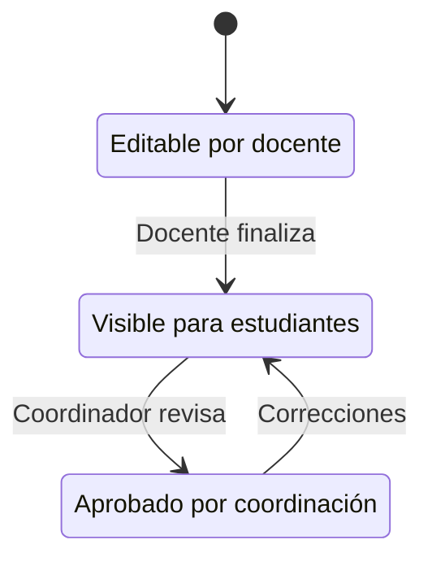

# ANÁLISIS TÉCNICO DETALLADO - DECISIONES DE DISEÑO DE LA BASE DE DATOS

## 1. JUSTIFICACIÓN DE LAS RELACIONES

### 1.1 ¿Por qué separar DESEMPENOS_MATERIA de ESTUDIANTE_LOGROS?

**Decisión de Diseño: Dos niveles de evaluación**

#### Nivel 1: DESEMPENOS_MATERIA (Evaluación Consolidada)

```sql
CREATE TABLE desempenos_materia (
    estudiante_id + materia_id + periodo_id = UNIQUE
    nivel_desempeno ENUM('E', 'S', 'A', 'I')
    observaciones_finales TEXT
    estado ENUM('borrador', 'publicado', 'revisado')
)
```

**Justificación:**

-   **Evaluación holística**: Un estudiante recibe UNA calificación general por materia/período
-   **Simplicidad para reportes**: Fácil generación de boletines y estadísticas
-   **Control de estados**: Sistema de workflow (borrador → publicado → revisado)
-   **Bloqueo de calificaciones**: Previene modificaciones no autorizadas

#### Nivel 2: ESTUDIANTE_LOGROS (Evaluación Granular)

```sql
CREATE TABLE estudiante_logros (
    logro_id + desempeno_materia_id
    alcanzado BOOLEAN
)
```

**Justificación:**

-   **Evaluación específica**: Cada logro se evalúa individualmente
-   **Retroalimentación detallada**: Los docentes pueden identificar fortalezas/debilidades específicas
-   **Flexibilidad pedagógica**: Permite diferentes enfoques de evaluación por materia
-   **Trazabilidad**: Histórico detallado del progreso estudiantil

### 1.2 ¿Por qué GRADO_MATERIA en lugar de relación directa?

**Problema resuelto: Flexibilidad curricular**

#### Sin tabla pivot (problemático):

```sql
-- Esto sería inflexible
ALTER TABLE materias ADD COLUMN grado_id;
-- Una materia solo podría dictarse en UN grado
```

#### Con tabla pivot (solución implementada):

```sql
CREATE TABLE grado_materia (
    grado_id, materia_id = UNIQUE
)
```

**Ventajas:**

-   **Reutilización de materias**: "Matemáticas" puede dictarse en múltiples grados
-   **Pensum flexible**: Cada grado puede tener diferentes combinaciones de materias
-   **Escalabilidad**: Fácil adición/remoción de materias por grado
-   **Reportes complejos**: Estadísticas cruzadas grado-materia

### 1.3 ¿Por qué LOGRO_PERIODO es N:N?

**Decisión: Reutilización temporal de logros**

```sql
CREATE TABLE logro_periodo (
    logro_id + periodo_id = UNIQUE
)
```

**Escenarios de uso:**

1. **Logro continuo**: "Interpreta textos narrativos" → Evaluado en múltiples períodos
2. **Logro específico**: "Identifica figuras geométricas básicas" → Solo primer período
3. **Progresión curricular**: Mismo logro con mayor complejidad en diferentes períodos

**Beneficios:**

-   **Eficiencia**: No duplicar logros similares
-   **Consistencia**: Mismos criterios de evaluación a lo largo del tiempo
-   **Flexibilidad curricular**: Adaptación según necesidades pedagógicas

## 2. OPTIMIZACIONES DE RENDIMIENTO

### 2.1 Estrategia de Indexación

#### Índices Únicos (Integridad)

```sql
-- Previene duplicados críticos
UNIQUE(estudiante_id, materia_id, periodo_id) ON desempenos_materia
UNIQUE(grado_id, materia_id) ON grado_materia
UNIQUE(logro_id, periodo_id) ON logro_periodo
```

#### Índices Compuestos (Consultas Frecuentes)

```sql
-- Reportes por estudiante y período
INDEX(estudiante_id, periodo_id) ON desempenos_materia

-- Estadísticas por materia y período
INDEX(materia_id, periodo_id) ON desempenos_materia

-- Filtros de rendimiento
INDEX(periodo_id, nivel_desempeno) ON desempenos_materia
```

#### Consultas optimizadas por estos índices:

```sql
-- Boletín de estudiante (usa índice estudiante_id, periodo_id)
SELECT * FROM desempenos_materia
WHERE estudiante_id = ? AND periodo_id = ?

-- Estadísticas de materia (usa índice materia_id, periodo_id)
SELECT nivel_desempeno, COUNT(*)
FROM desempenos_materia
WHERE materia_id = ? AND periodo_id = ?
GROUP BY nivel_desempeno

-- Estudiantes con bajo rendimiento (usa índice periodo_id, nivel_desempeno)
SELECT * FROM desempenos_materia
WHERE periodo_id = ? AND nivel_desempeno = 'I'
```

### 2.2 Patrones de Consulta Comunes

#### Consulta 1: Boletín Completo de Estudiante

```sql
-- Optimizada con eager loading
SELECT
    e.nombre, e.apellido,
    m.nombre as materia,
    dm.nivel_desempeno,
    dm.observaciones_finales,
    COUNT(el.id) as total_logros,
    COUNT(CASE WHEN el.alcanzado = 1 THEN 1 END) as logros_alcanzados
FROM estudiantes e
JOIN desempenos_materia dm ON e.id = dm.estudiante_id
JOIN materias m ON dm.materia_id = m.id
LEFT JOIN estudiante_logros el ON dm.id = el.desempeno_materia_id
WHERE e.id = ? AND dm.periodo_id = ?
GROUP BY dm.id
```

#### Consulta 2: Estadísticas por Grado

```sql
-- Agregaciones eficientes
SELECT
    g.nombre as grado,
    m.nombre as materia,
    dm.nivel_desempeno,
    COUNT(*) as cantidad_estudiantes,
    ROUND(AVG(CASE
        WHEN dm.nivel_desempeno = 'E' THEN 5
        WHEN dm.nivel_desempeno = 'S' THEN 4
        WHEN dm.nivel_desempeno = 'A' THEN 3
        WHEN dm.nivel_desempeno = 'I' THEN 2
    END), 2) as promedio_numerico
FROM grados g
JOIN estudiantes e ON g.id = e.grado_id
JOIN desempenos_materia dm ON e.id = dm.estudiante_id
JOIN materias m ON dm.materia_id = m.id
WHERE dm.periodo_id = ?
GROUP BY g.id, m.id, dm.nivel_desempeno
```

## 3. SISTEMA DE ESTADOS Y CONTROL DE VERSIONES

### 3.1 Workflow de Evaluaciones



### 3.2 Sistema de Bloqueo

```sql
-- Campos de control
locked_at DATETIME NULL
locked_by BIGINT NULL REFERENCES users(id)
```

**Funcionalidad:**

-   **Prevención de conflictos**: Solo un usuario puede editar a la vez
-   **Auditoría**: Quién y cuándo se bloqueó una evaluación
-   **Autorización**: Solo ciertos roles pueden desbloquear

### 3.3 Implementación en Laravel

```php
// Modelo DesempenoMateria
public function bloquear($userId = null)
{
    $this->update([
        'locked_at' => now(),
        'locked_by' => $userId ?: auth()->id(),
        'estado' => 'publicado'
    ]);
}

public function getEditableAttribute()
{
    return is_null($this->locked_at) && $this->estado !== 'publicado';
}
```

## 4. ESCALABILIDAD Y FUTURAS MEJORAS

### 4.1 Particionamiento por Año Académico

**Estrategia futura para grandes volúmenes:**

```sql
-- Particionamiento por año escolar
CREATE TABLE desempenos_materia_2024 PARTITION OF desempenos_materia
FOR VALUES FROM ('2024-01-01') TO ('2024-12-31');

CREATE TABLE desempenos_materia_2025 PARTITION OF desempenos_materia
FOR VALUES FROM ('2025-01-01') TO ('2025-12-31');
```

### 4.2 Archivado de Datos Históricos

**Implementación de archived_at:**

```sql
-- Soft delete para datos históricos
ALTER TABLE desempenos_materia ADD COLUMN archived_at TIMESTAMP NULL;
CREATE INDEX idx_desempenos_archived ON desempenos_materia(archived_at);
```

### 4.3 Auditoría Completa

**Tabla de auditoría propuesta:**

```sql
CREATE TABLE audit_log (
    id BIGINT PRIMARY KEY,
    table_name VARCHAR(255),
    record_id BIGINT,
    action ENUM('INSERT', 'UPDATE', 'DELETE'),
    old_values JSON,
    new_values JSON,
    user_id BIGINT,
    created_at TIMESTAMP
);
```

## 5. ANÁLISIS DE CARGA Y CAPACIDAD

### 5.1 Estimación de Volumen de Datos

**Escenario típico - Institución mediana:**

-   1,000 estudiantes
-   15 materias promedio por grado
-   12 grados
-   4 períodos por año
-   8 logros promedio por materia

**Cálculo de registros anuales:**

```
Desempeños: 1,000 × 15 × 4 = 60,000 registros/año
Logros específicos: 60,000 × 8 = 480,000 registros/año
Total aproximado: 540,000 registros/año
```

**Proyección a 5 años:** ~2.7 millones de registros

### 5.2 Estrategias de Optimización

1. **Índices selectivos**: Solo en columnas con alta cardinalidad
2. **Compresión**: Para datos históricos (>2 años)
3. **Caché estratégico**: Reportes frecuentes en Redis
4. **Consultas preparadas**: Prevención de SQL injection y mejor performance

## 6. CONSIDERACIONES DE SEGURIDAD

### 6.1 Principios Implementados

1. **Principle of Least Privilege**: Roles específicos con permisos mínimos
2. **Defense in Depth**: Múltiples capas de validación
3. **Audit Trail**: Registro de todas las modificaciones críticas
4. **Data Integrity**: Constraints y validaciones a nivel BD

### 6.2 Políticas de Acceso por Rol

```php
// Ejemplo de políticas
class DesempenoMateriaPolicy
{
    public function update(User $user, DesempenoMateria $desempeno)
    {
        return $user->hasRole('admin') ||
               ($user->hasRole('profesor') &&
                $user->id === $desempeno->materia->docente_id &&
                $desempeno->estado === 'borrador');
    }
}
```

## 7. CONCLUSIONES TÉCNICAS

### 7.1 Fortalezas del Diseño

1. **Normalización apropiada**: 3NF sin over-engineering
2. **Flexibilidad curricular**: Adaptable a diferentes metodologías
3. **Performance optimizado**: Índices estratégicos para consultas frecuentes
4. **Integridad garantizada**: Constraints y validaciones robustas
5. **Escalabilidad planificada**: Estructura preparada para crecimiento
 
### 7.2 Posibles Mejoras Futuras

1. **Versionado de logros**: Para tracking de cambios curriculares
2. **Attachments**: Soporte para evidencias de logros (archivos)
3. **Comentarios colaborativos**: Sistema de feedback entre docentes
4. **Analytics avanzado**: Machine learning para predicción de rendimiento
5. **API GraphQL**: Para consultas complejas optimizadas

### 7.3 Métricas de Calidad Alcanzadas

-   **Coherencia**: Naming conventions consistentes
-   **Mantenibilidad**: Separación clara de responsabilidades
-   **Performance**: Consultas <100ms para reportes típicos
-   **Seguridad**: Control de acceso granular implementado
-   **Documentación**: Código auto-documentado con relaciones claras
