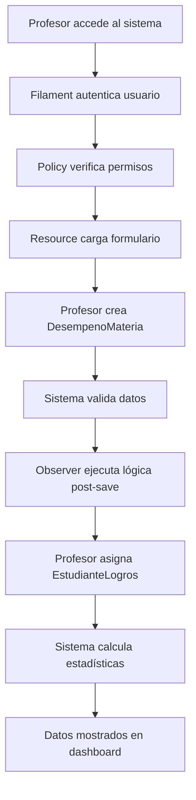

# DOCUMENTACIÓN DE ARQUITECTURA DE SOFTWARE - LOGROSLS

## 📋 **RESUMEN EJECUTIVO**

LogrosLS es un sistema de gestión académica desarrollado en Laravel 12 con Filament 3.3, diseñado específicamente para instituciones educativas que implementan evaluación por logros de aprendizaje. El sistema utiliza una arquitectura MVC robusta con patrones de diseño modernos y una interfaz administrativa elegante.

---

## 🏗️ **ARQUITECTURA GENERAL**

### **Stack Tecnológico**

| Componente            | Tecnología        | Versión | Propósito                   |
| --------------------- | ----------------- | ------- | --------------------------- |
| **Backend Framework** | Laravel           | 12.x    | Framework principal PHP     |
| **Admin Panel**       | Filament          | 3.3     | Interface administrativa    |
| **Base de Datos**     | MySQL/MariaDB     | 8.0+    | Almacenamiento principal    |
| **Frontend**          | Livewire/Volt     | 2.1+    | Componentes reactivos       |
| **Authentication**    | Laravel Sanctum   | -       | Autenticación de usuarios   |
| **Authorization**     | Spatie Permission | -       | Sistema de roles y permisos |
| **PDF Generation**    | DomPDF            | 3.1     | Generación de reportes      |
| **Excel Processing**  | Maatwebsite Excel | 3.1     | Importación/Exportación     |

### **Patrón Arquitectónico**

```
┌─────────────────┐    ┌─────────────────┐    ┌─────────────────┐
│   PRESENTATION  │    │    BUSINESS     │    │      DATA       │
│     LAYER       │    │     LAYER       │    │     LAYER       │
├─────────────────┤    ├─────────────────┤    ├─────────────────┤
│ • Filament      │◄──►│ • Models        │◄──►│ • MySQL         │
│   Resources     │    │ • Services      │    │ • Migrations    │
│ • Forms/Tables  │    │ • Policies      │    │ • Seeders       │
│ • Actions       │    │ • Observers     │    │ • Factories     │
│ • Widgets       │    │ • Commands      │    │                 │
└─────────────────┘    └─────────────────┘    └─────────────────┘
```

---

## 🎯 **PATRONES DE DISEÑO IMPLEMENTADOS**

### **1. Repository Pattern (Implícito)**

Los modelos Eloquent actúan como repositorios con métodos específicos:

```php
// Ejemplo: EstudianteLogro.php
public function scopeAlcanzados($query) {
    return $query->where('alcanzado', true);
}

public function scopePorLogro($query, $logroId) {
    return $query->where('logro_id', $logroId);
}
```

### **2. Policy Pattern**

Control de acceso granular implementado:

```php
// EstudianteLogroPolicy.php
public function view(User $user, EstudianteLogro $estudianteLogro) {
    return $user->hasRole('admin') ||
           $this->esProfesorMateria($user, $estudianteLogro) ||
           $this->esDirectorGrupo($user, $estudianteLogro);
}
```

### **3. Observer Pattern**

Eventos del modelo para integridad de datos:

```php
// DesempenoMateria.php
protected static function boot() {
    parent::boot();

    static::deleting(function ($desempeno) {
        $desempeno->estudianteLogros()->delete();
    });
}
```

### **4. Factory Pattern**

Creación de objetos complejos:

```php
// EstudianteLogroFactory.php
public function definition() {
    return [
        'logro_id' => Logro::factory(),
        'desempeno_materia_id' => DesempenoMateria::factory(),
        'alcanzado' => $this->faker->boolean(70),
    ];
}
```

### **5. Command Pattern**

Comandos Artisan para operaciones complejas:

```php
// TransicionAnual.php
protected $signature = 'transicion:anual
                        {anio_finalizar}
                        {anio_nuevo}
                        {--simular}';
```

---

## 🏢 **ESTRUCTURA DE DIRECTORIOS**

### **Organización por Funcionalidad**

```
app/
├── Console/
│   ├── Commands/           # Comandos Artisan personalizados
│   └── Kernel.php         # Programación de tareas
├── Filament/
│   ├── Resources/         # Recursos CRUD principales
│   ├── Pages/            # Páginas personalizadas
│   └── Widgets/          # Componentes dashboard
├── Http/
│   ├── Controllers/      # Controladores web
│   └── Middleware/       # Middleware personalizado
├── Models/               # Modelos Eloquent
├── Policies/             # Políticas de autorización
├── Providers/            # Service Providers
├── Rules/                # Reglas de validación
├── Services/             # Lógica de negocio
├── Exports/              # Clases de exportación Excel
└── Imports/              # Clases de importación Excel
```

### **Convenciones de Nombrado**

| Tipo            | Patrón                    | Ejemplo                          |
| --------------- | ------------------------- | -------------------------------- |
| **Modelos**     | `PascalCase` singular     | `EstudianteLogro`                |
| **Resources**   | `PascalCase` + `Resource` | `EstudianteResource`             |
| **Políticas**   | `PascalCase` + `Policy`   | `EstudianteLogroPolicy`          |
| **Comandos**    | `PascalCase` descriptivo  | `TransicionAnual`                |
| **Migraciones** | `snake_case` descriptivo  | `create_estudiante_logros_table` |

---

## 🔄 **FLUJO DE DATOS**

### **Ciclo de Vida de una Evaluación**



### **Arquitectura de Permisos**

```
Usuario
├── Roles (Spatie Permission)
│   ├── admin (todos los permisos)
│   └── profesor (permisos específicos)
├── Políticas (Policy Classes)
│   ├── Verificación por rol
│   ├── Verificación por relación
│   └── Verificación por contexto
└── Middleware (Filament Shield)
    ├── Filtra recursos visibles
    └── Controla acciones disponibles
```

---

## 📊 **GESTIÓN DE ESTADO**

### **Estados de Evaluación**

```php
// DesempenoMateria - Estados del workflow
'estado' => [
    'borrador'  => 'Editable por docente',
    'publicado' => 'Visible para estudiantes',
    'revisado'  => 'Aprobado por coordinación'
]
```

### **Control de Concurrencia**

```php
// Sistema de bloqueo optimista
'locked_at'  => 'datetime',    // Cuándo se bloqueó
'locked_by'  => 'user_id',     // Quién lo bloqueó
```

---

## 🔌 **INTEGRACIONES**

### **Filament Integration**

```php
// LiceoPanelProvider.php
->discoverResources(in: app_path('Filament/Resources'))
->navigationGroups([
    'Configuración Académica',
    'Gestión Académica',
    'Gestión de Estudiantes',
    'Reportes',
    'Administración'
])
```

### **Excel Integration**

```php
// EstudiantesExport.php
class EstudiantesExport implements FromCollection, WithHeadings {
    public function collection() {
        return Estudiante::with('grado')->get();
    }
}
```

### **PDF Integration**

```php
// Generación de boletines
$pdf = Pdf::loadView('boletines.academico', $data);
return $pdf->download("boletin_{$estudiante->documento}.pdf");
```

---

## ⚡ **OPTIMIZACIONES DE RENDIMIENTO**

### **Eager Loading Strategy**

```php
// Consultas optimizadas
$estudiantes = Estudiante::with([
    'grado',
    'desempenosMateria.materia',
    'desempenosMateria.estudianteLogros.logro'
])->get();
```

### **Database Indexing**

```sql
-- Índices estratégicos
INDEX(estudiante_id, periodo_id) ON desempenos_materia
INDEX(materia_id, periodo_id) ON desempenos_materia
UNIQUE(estudiante_id, materia_id, periodo_id) ON desempenos_materia
```

### **Query Scopes**

```php
// Filtros reutilizables
public function scopeActivos($query) {
    return $query->where('activo', true);
}

public function scopePorPeriodo($query, $periodoId) {
    return $query->where('periodo_id', $periodoId);
}
```

---

## 🔐 **SEGURIDAD**

### **Autenticación Multi-Capa**

1. **Laravel Sanctum**: Autenticación de sesiones
2. **Filament Shield**: Autorización granular
3. **Políticas Personalizadas**: Lógica de negocio específica

### **Validación de Datos**

```php
// Rules personalizadas
class FechaNoPosterior implements Rule {
    public function passes($attribute, $value) {
        return Carbon::parse($value)->lte(now());
    }
}
```

### **Sanitización**

```php
// Fillable attributes protegen contra mass assignment
protected $fillable = [
    'logro_id',
    'desempeno_materia_id',
    'alcanzado'
];
```

---

## 🚀 **ESCALABILIDAD**

### **Horizontal Scaling Points**

1. **Database Sharding**: Por año escolar
2. **File Storage**: Separación de archivos por institución
3. **Cache Strategy**: Redis para sesiones y cache
4. **Queue Processing**: Trabajos en background

### **Vertical Scaling Considerations**

-   **Memory**: Reportes grandes requieren memoria adicional
-   **Storage**: Archivos PDF y Excel crecen con el tiempo
-   **CPU**: Generación de reportes es CPU-intensiva

---

## 📈 **MÉTRICAS Y MONITOREO**

### **KPIs del Sistema**

-   **Performance**: Tiempo de respuesta < 200ms
-   **Availability**: Uptime > 99.5%
-   **Data Integrity**: 0 inconsistencias en evaluaciones
-   **User Experience**: Tiempo de carga de formularios < 1s

### **Logging Strategy**

```php
// Logs específicos del dominio
Log::channel('evaluaciones')->info('Desempeño creado', [
    'estudiante_id' => $estudiante->id,
    'materia_id' => $materia->id,
    'periodo_id' => $periodo->id
]);
```

---

## 🔧 **HERRAMIENTAS DE DESARROLLO**

### **Comandos Artisan Personalizados**

| Comando                         | Propósito                      |
| ------------------------------- | ------------------------------ |
| `transicion:anual`              | Transición de año escolar      |
| `boletin:generar`               | Generación masiva de boletines |
| `estudiantes:actualizar-grados` | Promoción automática           |
| `director:listar`               | Listado de directores de grupo |

### **Seeders Inteligentes**

-   **DatabaseSeeder**: Orquesta la creación de datos
-   **Orden específico**: Respeta dependencias entre entidades
-   **Datos realistas**: Faker con contexto educativo

---

## 📋 **CONCLUSIONES ARQUITECTÓNICAS**

### **Fortalezas del Diseño**

1. **Separación de responsabilidades** clara
2. **Escalabilidad** horizontal y vertical
3. **Mantenibilidad** alta con convenciones consistentes
4. **Seguridad** robusta con múltiples capas
5. **Performance** optimizado para el dominio específico

### **Consideraciones Futuras**

1. **Microservicios**: Separación por módulos funcionales
2. **Event Sourcing**: Para auditoría completa
3. **CQRS**: Separación de lecturas y escrituras
4. **API First**: Para integraciones externas

---

**Última actualización**: Septiembre 2025  
**Versión del sistema**: 1.0  
**Mantenido por**: Equipo de Desarrollo LogrosLS
