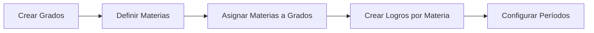

# Documentación del Sistema de Logros Académicos

## Contexto del Dominio

Este sistema implementa un modelo educativo basado en **logros de aprendizaje** donde cada estudiante es evaluado según su progreso en competencias específicas, no por calificaciones numéricas tradicionales.

## Modelo de Evaluación

### Niveles de Desempeño

-   **E (Excelente)**: Dominio superior del logro
-   **S (Sobresaliente)**: Dominio satisfactorio del logro
-   **A (Aceptable)**: Dominio básico del logro
-   **I (Insuficiente)**: No alcanza el logro esperado

### Estructura de un Logro

```php
Logro {
    codigo: "MAT-1-001"           // Identificador único
    titulo: "Suma básica"         // Nombre descriptivo
    competencia: "Pensamiento numérico"
    tema: "Operaciones básicas"
    indicador_desempeno: "Realiza sumas de dos dígitos sin reagrupación"
    materia_id: 1                 // Vinculado a Matemáticas
    nivel_dificultad: "bajo"      // bajo, medio, alto
    tipo: "conocimiento"          // conocimiento, habilidad, actitud, valor
}
```

## Flujo de Evaluación

### 1. Configuración Académica (Admin)



### 2. Gestión de Estudiantes

-   Registro de estudiantes
-   Asignación a grado específico
-   Asignación de director de grupo

### 3. Proceso de Evaluación

```php
// Un profesor evalúa a un estudiante en un logro específico
EstudianteLogro::create([
    'estudiante_id' => 1,
    'logro_id' => 5,
    'periodo_id' => 2,
    'nivel_desempeno' => 'S',
    'observaciones' => 'Demuestra comprensión clara del concepto',
    'fecha_asignacion' => now()
]);
```

## Reglas de Negocio Críticas

### Restricciones del Sistema

1. **Un estudiante no puede ser evaluado dos veces en el mismo logro durante el mismo período**
2. **Un usuario solo puede ser director de un grado a la vez**
3. **Los logros están vinculados a materias específicas**
4. **Solo puede haber un período activo por vez**

### Lógica de Permisos por Rol

#### Profesor Regular

-   Ve solo estudiantes de los grados donde imparte materias
-   Puede evaluar solo en sus materias asignadas
-   No puede modificar configuración académica

#### Director de Grupo

-   Todos los permisos de profesor regular
-   Acceso completo a estudiantes de su grado
-   Puede ver evaluaciones de todas las materias de su grado

#### Administrador

-   Acceso completo al sistema
-   Configuración académica
-   Gestión de usuarios y permisos

## Casos de Uso Complejos

### Evaluación Masiva

```php
// Evaluar múltiples estudiantes en el mismo logro
$estudiantes = Grado::find(1)->estudiantes;
$logro = Logro::find(10);
$periodo = Periodo::where('activo', true)->first();

foreach($estudiantes as $estudiante) {
    EstudianteLogro::updateOrCreate([
        'estudiante_id' => $estudiante->id,
        'logro_id' => $logro->id,
        'periodo_id' => $periodo->id
    ], [
        'nivel_desempeno' => 'A', // Valor por defecto
        'fecha_asignacion' => now()
    ]);
}
```

### Generación de Boletín

Un boletín consolida todas las evaluaciones de un estudiante en un período:

```php
$evaluaciones = EstudianteLogro::where('estudiante_id', $estudianteId)
    ->where('periodo_id', $periodoId)
    ->with(['logro.materia'])
    ->get()
    ->groupBy('logro.materia.nombre');
```

### Promoción de Estudiantes

```php
// Lógica para determinar si un estudiante puede ser promovido
$evaluaciones = $estudiante->estudianteLogros()
    ->whereHas('periodo', fn($q) => $q->where('año_escolar', 2024))
    ->get();

$insuficientes = $evaluaciones->where('nivel_desempeno', 'I')->count();
$totalLogros = $evaluaciones->count();

$puedePromoverse = ($insuficientes / $totalLogros) < 0.25; // Menos del 25% insuficiente
```

## Integraciones y Extensiones

### Sistema de Reportes

-   **Boletín Individual**: PDF con logros por estudiante y período
-   **Reporte de Grado**: Consolidado de un grado completo
-   **Estadísticas Institucionales**: Métricas de desempeño general

### Posibles Extensiones

1. **API REST**: Para integraciones con sistemas externos
2. **Notificaciones**: Alertas automáticas para padres/acudientes
3. **Analytics**: Dashboard de métricas avanzadas
4. **Mobile App**: Para consulta de padres de familia

## Migración desde Sistemas Tradicionales

### Mapeo de Calificaciones

Si se migra desde un sistema numérico:

```php
function mapearCalificacion($nota) {
    return match(true) {
        $nota >= 4.5 => 'E',
        $nota >= 4.0 => 'S',
        $nota >= 3.0 => 'A',
        default => 'I'
    };
}
```

### Consideraciones de Migración

-   Los logros deben definirse retrospectivamente
-   Las calificaciones históricas requieren interpretación manual
-   Los períodos deben alinearse con el nuevo sistema

---

> **Importante**: Este sistema representa un cambio paradigmático en la evaluación educativa. La implementación requiere capacitación docente y ajuste de procesos institucionales.
